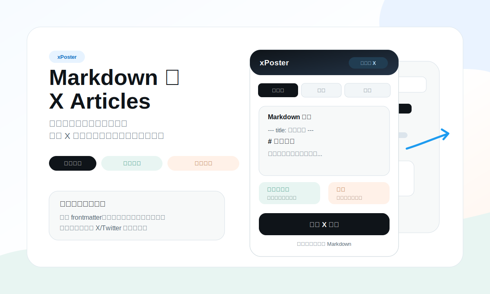
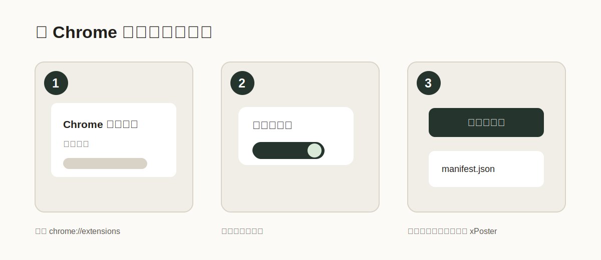
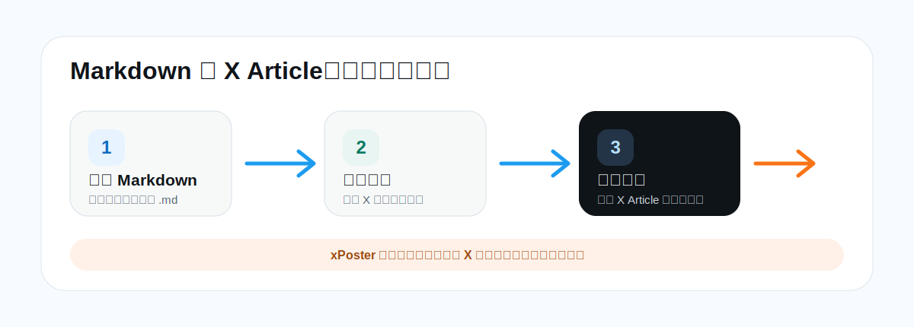

# xPoster

把写好的 Markdown 长文搬进 X Articles，不再一段段复制、重新排版。

xPoster 是一个免费开源的 Chrome 扩展，适合先用 Markdown 写文章、最后再发布到 X 的人。你可以把草稿粘贴进侧边栏，选择 `.md` 文件，或者一次拖入多篇 Markdown；xPoster 会检查当前 X Article 编辑器，把内容写入 X 草稿。最后是否发布，仍然由你自己在 X 里决定。

[English README](README.md) · [Chrome 应用商店](https://chromewebstore.google.com/detail/xposter/iimkimodgdjnnmdopeolboakhjmhfbbj?authuser=0&hl=zh-CN) · [使用指南](docs/usage.zh-CN.md) · [隐私说明](docs/privacy.zh-CN.md)



## 它能做什么

- 把 Markdown 草稿写进 X Article，同时在侧边栏保留原始 Markdown。
- 自动处理手工复制最麻烦的内容：标题、段落、列表、引用、行内格式、链接、图片、表格、代码块、分割线和 X/Twitter 推文嵌入。
- 写入前先做检查，告诉你草稿、当前 X Article 标签页、编辑器桥接和图片是否准备好。
- 支持单篇草稿，也支持一次导入多篇 `.md` 后排队写入。
- 保存可恢复记录，之前用过的 Markdown 可以搜索、复制、编辑并再次写入。
- 可选在可读取的 X Article 页面显示一个低调的 Markdown 导出按钮。
- 本地优先：不需要账号、订阅、后台服务、统计分析、许可证服务器或付费墙。

## 安装

普通用户推荐直接安装应用商店版本：

1. 打开 [xPoster Chrome Web Store 页面](https://chromewebstore.google.com/detail/xposter/iimkimodgdjnnmdopeolboakhjmhfbbj?authuser=0&hl=zh-CN)。
2. 点击 **添加至 Chrome**。
3. 打开或新建一篇 X Article：`https://x.com/compose/articles`。

应用商店版本是推荐安装方式，会持续收到更新。

开发者源码安装：



1. 下载或 clone 这个仓库。
2. 打开 Chrome 的 `chrome://extensions`。
3. 打开右上角 **开发者模式**。
4. 点击 **加载已解压的扩展程序**。
5. 选择包含 `manifest.json` 的 xPoster 项目文件夹。

普通用户不需要源码安装；它更适合审计、测试或自定义扩展。

## 使用流程



1. 打开或新建一篇 X Article：`https://x.com/compose/articles`。
2. 打开 xPoster 侧边栏。
3. 粘贴 Markdown，选择 `.md` 文件，或拖入一篇或多篇 Markdown。
4. 检查识别出的标题、正文、媒体、表格、代码、分割线和嵌入内容。
5. 点击 **Check article / 检查文章**，确认当前 X Article 编辑器可以访问。
6. 点击 **Write to X draft / 写入 X 草稿**。排队草稿可以逐篇写入、在弹窗里编辑，也可以批量写入。
7. 回到 X Article 编辑器里检查导入结果。
8. 确认没问题后，再手动点击 X 自己的发布按钮。

## 支持哪些 Markdown

| Markdown 内容 | xPoster 会做什么 |
| --- | --- |
| `--- title: 标题 ---` | 尽量用 frontmatter 设置 X 文章标题。 |
| `# 一级标题` | 没有 frontmatter 标题时，尽量用第一个 H1 当标题。 |
| 段落、列表、引用 | 转成 X 编辑器能接受的正文。 |
| `**加粗**`、`*斜体*`、`` `代码` ``、链接 | 尽量保留行内格式。 |
| `` | 在能读取图片文件时上传图片。 |
| Markdown 表格 | 渲染成图片，避免 X 里表格变形。 |
| X/Twitter 推文链接 | 尽量插入为 X 的推文嵌入块。 |
| 代码块、分割线 | 尽量转成 X Article 支持的特殊内容块。 |

测试草稿在这里：[fixtures/live-x-smoke.md](fixtures/live-x-smoke.md)。

## 图片说明

本地图片：把图片文件和 Markdown 放在容易找到的位置。xPoster 需要你选择本地图片所在文件夹，才能读取相对路径图片。

网页图片：Chrome 可能会弹出一次授权，询问是否允许 xPoster 读取图片所在网站。xPoster 需要读取图片文件本身，才能把它交给 X 上传。下载失败的网页图片会保留为 Markdown 链接，不会变成 X 里的上传图片。

公开源码版本不会暴露私人图床域名。如果你维护自己的 fork，并且需要支持某个固定图片网站，请只在你自己的 manifest 中声明你信任的图片域名。

## 隐私与安全

- 草稿和导入记录保存在你自己的浏览器扩展本地存储里。
- xPoster 运行在 `x.com` 和 `twitter.com`，因为它需要填写 X Article 编辑器，也需要在可选导出功能中读取文章页面。
- xPoster 使用 `tabs` 权限，是为了找到并检查当前 X Article 标签页。
- 只有当草稿里有需要下载的网页图片时，才会请求对应图片网站的可选权限。
- xPoster 没有分析统计、后台服务、许可证验证或付费墙。
- xPoster 不会点击发布。最终发布永远由你自己在 X 中确认。

更多隐私说明见：[docs/privacy.zh-CN.md](docs/privacy.zh-CN.md)。

## 开发者检查

这个项目依赖很轻。Node 只用于本地校验。

```bash
npm run check
npm test
npm run verify
```

`npm run check` 会检查 JavaScript 语法、`manifest.json` 和 i18n 覆盖。

`npm test` 会检查测试草稿、manifest 引用、图标和 Markdown 解析行为。

## 项目结构

```text
manifest.json          Chrome 扩展 manifest
sidepanel.html         主侧边栏界面
sidepanel.css          侧边栏样式
sidepanel.js           侧边栏流程和导入控制
diagnostics.html       工具栏诊断弹窗
diagnostics.js         诊断界面逻辑
src/background.js      MV3 service worker 和图片下载代理
src/content.js         X 页面脚本、页面状态和 Markdown 导出
src/main-world.js      MAIN world Draft.js / X 编辑器适配
src/shared.js          Markdown 解析、写入计划、本地图片工具
fixtures/              用于检查和演示的 Markdown 示例
docs/                  使用指南、图片和隐私说明
scripts/               本地校验脚本
```

## 常见问题

**我在 Chrome 里看不到 xPoster。**
请安装应用商店版本；如果用源码安装，请打开开发者模式，并选择包含 `manifest.json` 的文件夹。

**写入 X 草稿按钮不能点。**
先载入或编辑 Markdown 草稿，再打开 X Article 标签页，然后点击 **Check article / 检查文章**。

**图片没有变成 X 里的图片。**
本地图片需要选择图片文件夹。网页图片需要在 Chrome 授权后能公开下载。

**导入后看起来不对。**
先不要发布。可以在 X 里手动修改，或者从保存的 Markdown 记录重新开始。

**X 改版导致失效。**
欢迎在 GitHub 提 issue，并附上 Chrome 版本、xPoster 版本和工具栏诊断弹窗里的 JSON。

## 参与贡献

欢迎提交 issue 和 pull request。可以先看 [CONTRIBUTING.md](CONTRIBUTING.md)。

## 支持作者

xPoster 会继续保持免费开源。如果它帮你节省了整理和发布长文的时间，也愿意支持后续维护，可以扫描下面的 Buy Me a Coffee 二维码请作者喝杯咖啡。完全自愿；反馈、Star 和 issue 同样有帮助。


## 联系作者

可以通过作者 X 主页联系：[@xiaoxiaodong01](https://x.com/xiaoxiaodong01)。

## 开源协议

MIT。见 [LICENSE](LICENSE)。
